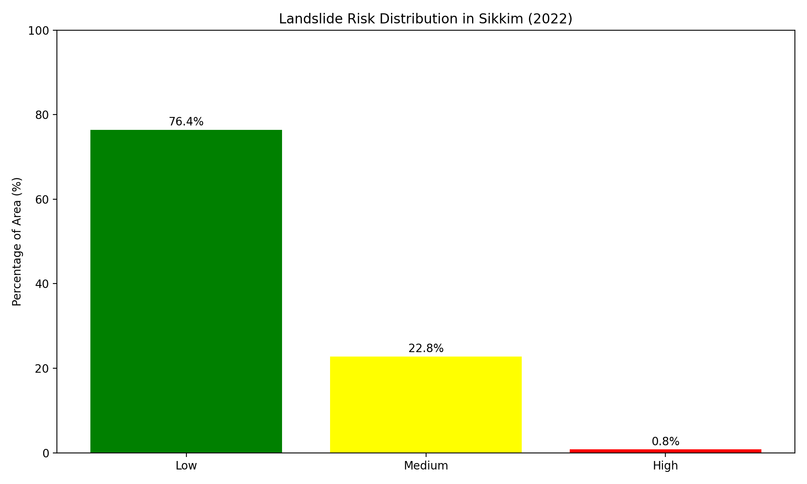

# Landslide Detection and Risk Mapping using Deep Learning (U-Net) and Landslide4Sense

This project presents a deep learning pipeline to detect landslides from satellite imagery using the U-Net architecture, trained on the Landslide4Sense dataset. The detected outputs are subsequently integrated with Google Earth Engine (GEE) to generate geospatial landslide risk maps to assist in analysis and early warning systems.

---

## Project Highlights

- **Dataset**: Landslide4Sense — labeled satellite imagery for landslide regions.
- **Model**: U-Net architecture for semantic segmentation of landslide-prone areas.
- **Risk Mapping**: Post-inference predictions are georeferenced and visualized on Google Earth Engine for real-world applicability.
- **Evaluation**: The model is assessed using standard metrics such as Intersection over Union (IoU), F1-score, and accuracy.
- **Application**: The output can be used for disaster mitigation, land-use planning, and early warning systems.

---

## Dataset

- **Source**: [Landslide4Sense](https://zenodo.org/record/7335816)
- **Format**: `.h5` files containing:
  - Training, validation, and testing satellite images
  - Corresponding binary masks representing landslide regions

---

## Results

### 1. Model Prediction Sample

The following figure illustrates an example of the model’s landslide prediction on a sample satellite image.

The U-Net model successfully identifies the landslide-affected regions from satellite imagery using semantic segmentation techniques.

---

### 2. Training Metrics Over Epochs

The graph below shows the progression of model performance over multiple epochs. Metrics such as accuracy, IoU, and F1-score demonstrate convergence and generalization.

This trend indicates consistent model improvement and minimal overfitting throughout training.

---

### 3. Landslide Risk Map via Google Earth Engine

The image below is a risk map generated from the model's predictions and overlaid on satellite data using Google Earth Engine.

These maps are useful for highlighting potentially vulnerable regions, aiding authorities in decision-making and emergency planning.

---

### 4. Risk Distribution

The chart below presents the spatial distribution of predicted landslide risk levels, categorized by geographic zones or regions.

This analysis supports resource prioritization and enables stakeholders to focus attention on high-risk areas based on model inference.

---
